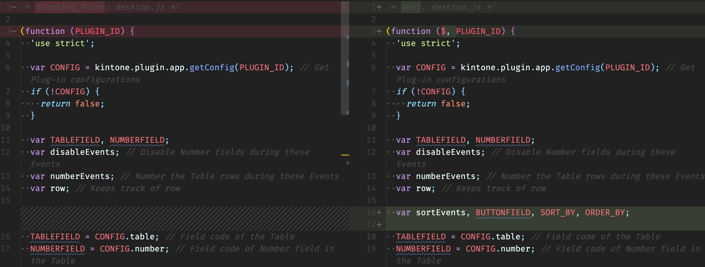
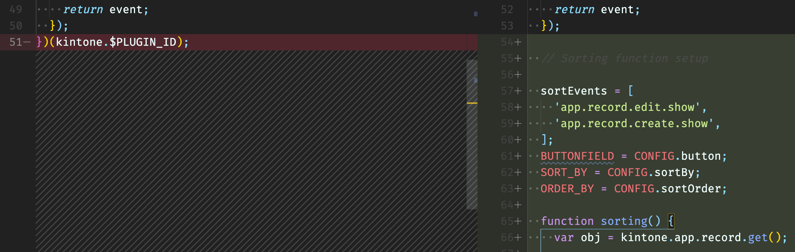
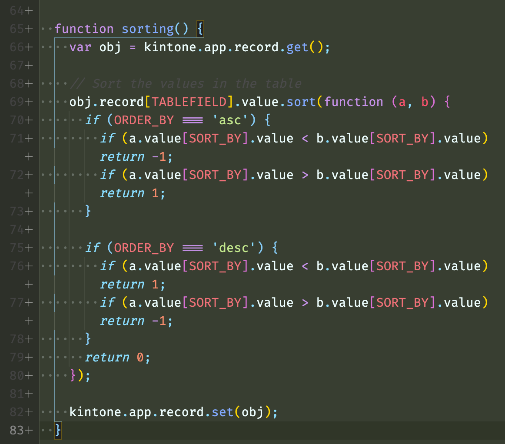
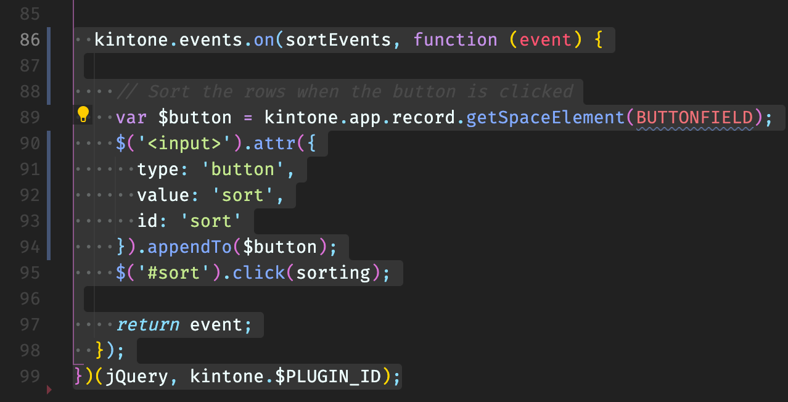

# LiveCoding Part 1 Steps

## File Breakdown

| File                                 | Description                                              |
| ------------------------------------ | -------------------------------------------------------- |
| src/ **manifest.json**               | Plug-in files' outline; includes required fields array   |
| src/css/ **51-modern-default.css**   | Kintone-like styling; Styles `kintoneplugin-`xyz classes |
| src/html/ **config.html**            | GUI for the user to configure the Plug-in                |
| src/js/ **config.js**                | Alters the JS customization based on user configuration  |
| src/js/ **desktop.js**               | The actual JS customization: Sort & Insert row number    |
| src/js/ **kintone-config-helper.js** | Library that provides Plug-in setting helper functions   |

---

## src/js/`desktop.js`
[**desktop.js**](1_Starting_Point/src/js/desktop.js) contains the actual JavaScript customization that alters the Kintone App.


### Step 1 - Setup desktop.js for the new inputs and activate jQuery

```javascript
(function ($, PLUGIN_ID) {

  // script here

})(jQuery, kintone.$PLUGIN_ID);
```

Declare an array to store Events when sorting takes place.
Get three values from user configuration.

```javascript
var sortEvents, BUTTONFIELD, SORT_BY, ORDER_BY;
```




### Step 2 - Prepping
First, set the Events with the sorting function should take place.
Then get the button, sortBy, and sortOrder from user configuration.

```javascript
sortEvents = [
  'app.record.edit.show',
  'app.record.create.show',
];

BUTTONFIELD = CONFIG.button;
SORT_BY = CONFIG.sortBy;
ORDER_BY = CONFIG.sortOrder;
```




#### Setting up a sorting() function

Get the record and set the record

```javascript
function sorting() {
  var obj = kintone.app.record.get();

  // sorting here

  kintone.app.record.set(obj);
}
```


#### Sort the Table by the selected field's value

```javascript
obj.record[TABLEFIELD].value.sort(function (a, b) {
  if (ORDER_BY === 'asc') {
    if (a.value[SORT_BY].value < b.value[SORT_BY].value) return -1;
    if (a.value[SORT_BY].value > b.value[SORT_BY].value) return 1;
  }

  if (ORDER_BY === 'desc') {
    if (a.value[SORT_BY].value < b.value[SORT_BY].value) return 1;
    if (a.value[SORT_BY].value > b.value[SORT_BY].value) return -1;
  }
  return 0;
});
```




#### Button Trigger

```javascript
kintone.events.on(sortEvents, function (event) {

  // Sort the rows when the button is clicked
  var $button = kintone.app.record.getSpaceElement(BUTTONFIELD);
  $('<input>').attr({
    type: 'button',
    value: 'sort',
    id: 'sort'
  }).appendTo($button);
  $('#sort').click(sorting);

  return event;
});
```



---

## src/js/`config.js`
[**config.js**](1_Starting_Point/src/js/config.js) contains the script to get the user configuration, such as field codes needed to determine which fields to get data from and which to insert row numbers into.


### Step 1 - Get the User Configuration
We need to get the Space field, the sort-by field, and the order to sort the rows by. The [config.html](1_Starting_Point/src/html/config.html)


### Step 2 - Enhance the setDropDown function
We are going from only getting one Number field to getting a Number field for row-numbering & table-sorting, Space field, and sort order. This means we need to generate three more drop-downs on the Plug-in configuration page.
  - Add parameters to the setDropDown function: `dropdownField`, `fieldType`, `prop`
  - Swap `'NUMBER'` to `fieldType` to reflect the parameter change.
  - Set cases for Space field & Number fields


### Step 3 - Call the setDropDown function
Call the `setDropDown` function three times for row-numbering, table-sorting, and Space field inputs.


### Step 4 - Set the inputs when the form is submitted
Save the button location, sort by field, ad sort order.

