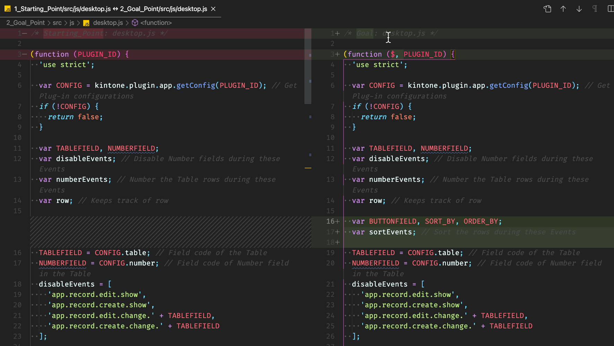
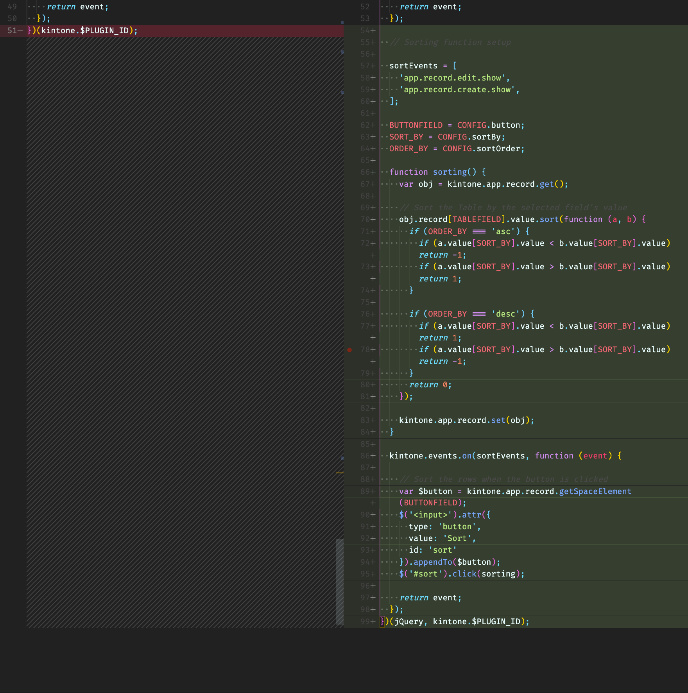
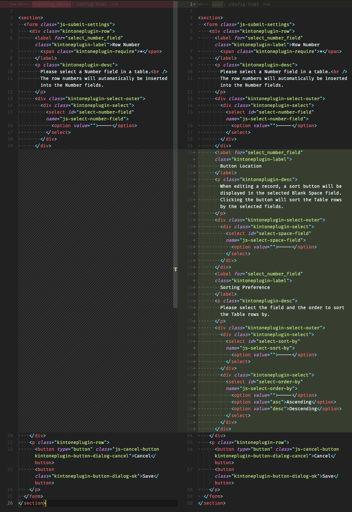
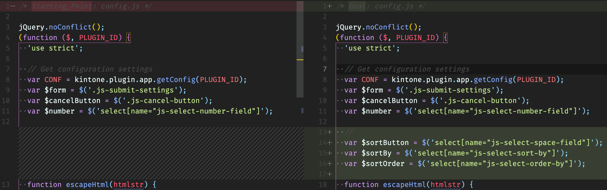
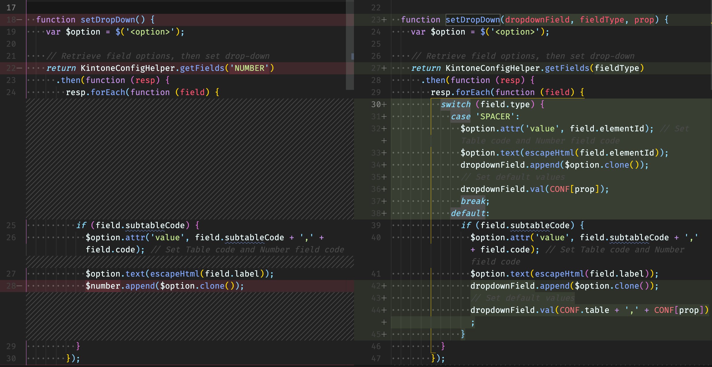
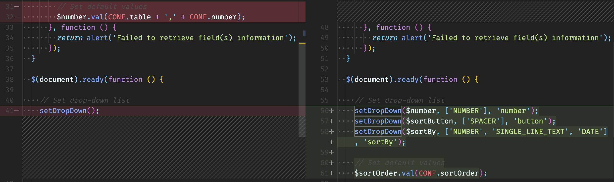
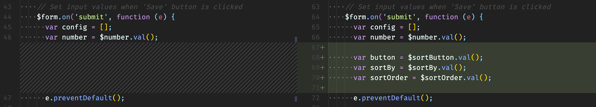
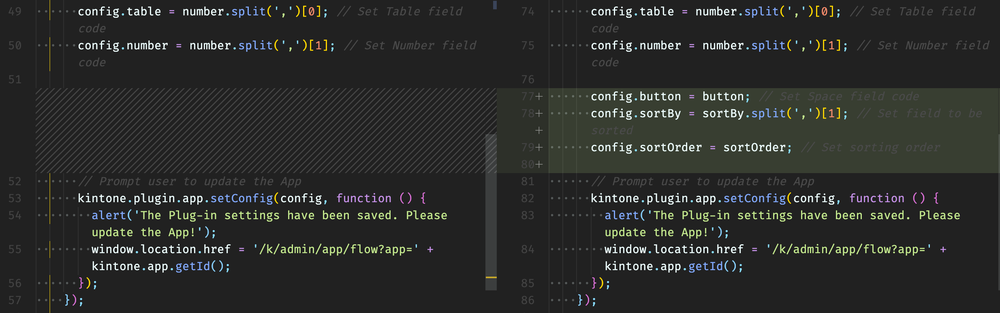

# Steps for adding the sorting function to Table Numbering Plug-in

Note: These instructions are also [viewable as slides](https://slides.trouni.com/?src=https://raw.githubusercontent.com/ahandsel/Table-Utility-Plug-in/main/Step_By_Step.md#/) 🎦

---

## File Breakdown

| File                                 | Description                                                |
| ------------------------------------ | ---------------------------------------------------------- |
| src/ **manifest.json**               | Outlines the Plug-in files; includes required fields array |
| src/css/ **51-modern-default.css**   | Kintone-like styling; Styles `kintoneplugin-`xyz classes   |
| src/image/ **icon.png**              | Icon for the Plug-in                                       |
| src/html/ **config.html**            | GUI for the user to configure the Plug-in                  |
| src/js/ **config.js**                | Alters the JS customization based on user configuration    |
| src/js/ **desktop.js**               | The actual JS customization: Sort & Insert row number      |
| src/js/ **kintone-config-helper.js** | Library that provides Plug-in setting helper functions     |

---

## src/js/`desktop.js` - Customization
[**desktop.js**](1_Starting_Point/src/js/desktop.js) contains the actual JavaScript customization that alters the Kintone App.


### Step 1 - Incorporating jQuery

Adding support for jQuery, a JavaScript library designed to simplify HTML DOM tree traversal & manipulation.

```javascript
(function ($, PLUGIN_ID) {

  // script here

})(jQuery, kintone.$PLUGIN_ID);
```


### Step 2 - Kintone Events & User Input

Declare an array to store Kintone Events when sorting should take place.  
Get three values from user configuration.

```javascript
var sortEvents, BUTTONFIELD, SORT_BY, ORDER_BY;
```

Now set the Kintone Events in line with the sorting function should take place.  
Then get the button, sortBy, and sortOrder from user configuration.

```javascript
sortEvents = [
  'app.record.edit.show',
  'app.record.create.show',
];

BUTTONFIELD = CONFIG.button;
SORT_BY = CONFIG.sortBy;
ORDER_BY = CONFIG.sortOrder;
```


### Step 3 - Setting up a sorting() function

Get the record and set the record

```javascript
function sorting() {
  var obj = kintone.app.record.get();

  // sorting here

  kintone.app.record.set(obj);
}
```


### Step 4 - Sort the Table by the selected field's value

```javascript
obj.record[TABLEFIELD].value.sort(function (a, b) {
  if (ORDER_BY === 'asc') {
    if (a.value[SORT_BY].value < b.value[SORT_BY].value) return -1;
    if (a.value[SORT_BY].value > b.value[SORT_BY].value) return 1;
  }

  if (ORDER_BY === 'desc') {
    if (a.value[SORT_BY].value < b.value[SORT_BY].value) return 1;
    if (a.value[SORT_BY].value > b.value[SORT_BY].value) return -1;
  }
  return 0;
});
```


### Step 5 - Button Trigger

```javascript
kintone.events.on(sortEvents, function (event) {

  // Sort the rows when the button is clicked
  var $button = kintone.app.record.getSpaceElement(BUTTONFIELD);
  $('<input>').attr({
    type: 'button',
    value: 'Sort',
    id: 'sort'
  }).appendTo($button);
  $('#sort').click(sorting);

  return event;
});
```


### Visual Comparison

Line 1 ~ 18
  

Line 51 ~ 99
  

---

## Plug-in Development Helper

Follow two files are helper files to simplify Plug-in development.  
Do not modify them.


### Kintone Config Helper
  * [**kintone-config-helper.js**](1_Starting_Point/src/js/kintone-config-helper.js) is a JavaScript library that supports the development of Kintone plug-ins.
  * It provides methods to retrieve field data from Apps, which are used for creating components in the plug-in config page.
  * Details: [Introduction to Kintone Config Helper](https://developer.kintone.io/hc/en-us/articles/360015822513) article.


### Stylesheet to make Kintone-like UI
  * [**51-modern-default.css**](1_Starting_Point/src/css/51-modern-default.css) is a CSS for designing a Kintone-like UI.
  * Plug-in Stylesheet Guide to reproduce the DOM structure of the checkbox component in the JavaScript code.
  * Details: [Plug-in settings stylesheet guide](https://developer.kintone.io/hc/en-us/articles/212494718)

---

## src/html/`config.html`
[**config.html**](1_Starting_Point/src/html/config.html) generates the Plug-in settings page where the user can configure the Plug-in being set to a Kintone App. Vital information like the Number field to insert the row numbers into is configured here.


### Step 1 - Add a drop-down menu to select the Blank Space field

`class="kintoneplugin-...` is added to use **kintone-config-helper.js**.

```html
<label for="select_number_field" class="kintoneplugin-label">
  Button Location
</label>
<p class="kintoneplugin-desc">
  When editing a record, a sort button will be displayed in the selected Blank Space field.
  Clicking the button will sort the Table rows by the selected fields.
</p>
<div class="kintoneplugin-select-outer">
  <div class="kintoneplugin-select">
    <select id="select-space-field" name="js-select-space-field">
      <option value="">-----</option>
    </select>
  </div>
</div>
```


### Step 2 - Add a drop-down menu to select the field to sort by & the order

```html
<label for="select_number_field" class="kintoneplugin-label">
  Sorting Preference
</label>
<p class="kintoneplugin-desc">
  Please select the field and the order to sort the Table rows by.
</p>
<div class="kintoneplugin-select-outer">
  <div class="kintoneplugin-select">
    <select id="select-sort-by" name="js-select-sort-by">
      <option value="">-----</option>
    </select>
  </div>
  <div class="kintoneplugin-select">
    <select id="select-order-by" name="js-select-order-by">
      <option value="">-----</option>
      <option value="asc">Ascending</option>
      <option value="desc">Descending</option>
    </select>
  </div>
</div>
```


### Visual Comparison

  

---

## src/js/`config.js`
[**config.js**](1_Starting_Point/src/js/config.js) contains the script to get the user configuration, such as field codes needed to determine which fields to get data from and which to insert row numbers into.


### Step 1 - Get the User Configuration
We need to get the Space field, the sort-by field, and the order to sort the rows by. The [config.html](1_Starting_Point/src/html/config.html)

```javascript
  var $sortButton = $('select[name="js-select-space-field"]');
  var $sortBy = $('select[name="js-select-sort-by"]');
  var $sortOrder = $('select[name="js-select-order-by"]');
```


### Step 2 - Enhance the setDropDown function
We are going from only getting one Number field to getting a Number field for row-numbering & table-sorting, Space field, and sort order. This means we need to generate three more drop-downs on the Plug-in configuration page.
  * Add parameters to the setDropDown function: `dropdownField`, `fieldType`, `prop`
  * Swap `'NUMBER'` to `fieldType` to reflect the parameter change.
  * Set cases for Space field & Number fields

```javascript
function setDropDown(dropdownField, fieldType, prop) {
  var $option = $('<option>');
```

```javascript
// Retrieve field options, then set drop-down
return KintoneConfigHelper.getFields(fieldType)
  .then(function (resp) {
    resp.forEach(function (field) {
      switch (field.type) {
        case 'SPACER':
          // Set Table code and Number field code
          $option.attr('value', field.elementId); 
          $option.text(escapeHtml(field.elementId));
          dropdownField.append($option.clone());
          // Set default values
          dropdownField.val(CONF[prop]);
          break;
        default:
          if (field.subtableCode) {
            // Set Table code and Number field code
            $option.attr('value', field.subtableCode + ',' + field.code);
            $option.text(escapeHtml(field.label));
            dropdownField.append($option.clone());
            // Set default values
            dropdownField.val(CONF.table + ',' + CONF[prop]);
          }
      }
    });
```


### Step 3 - Call the setDropDown function
Call the `setDropDown` function three times for row-numbering, table-sorting, and Space field inputs.

```javascript
$(document).ready(function () {

  // Set drop-down list
  setDropDown($number, ['NUMBER'], 'number');
  setDropDown($sortButton, ['SPACER'], 'button');
  setDropDown($sortBy, ['NUMBER', 'SINGLE_LINE_TEXT', 'DATE'], 'sortBy');
```

### Step 4 - Set the inputs when the form is submitted
Inside the `$form.on(...);` add variables for button location, sort by field, and sort order. We want to save the information when the 'Save' button is clicked.

```javascript
$form.on('submit', function (e) {
  var config = [];
  var number = $number.val();

  var button = $sortButton.val();
  var sortBy = $sortBy.val();
  var sortOrder = $sortOrder.val();

  e.preventDefault();
```


### Visual Comparison

  
...
  
  
  
...
  
...

---

## Optional files to modify

### src/image/`icon.png`
Change the [**icon.png**](1_Starting_Point/src/image/icon.png) with the icon of your choice.

### src/`manifest.json`
[**manifest.json**](1_Starting_Point/src/manifest.json) outlines the Plug-in files.  
This is where Plug-in names, description, and URL is set.
Also, if filenames have been changed or additional JavaScript libraries want to be used, update the file structure and CDN links to match the changes.

```json
  "name": {
    "en": "Table Numbering Plug-in"
  },
  "description": {
    "en": "This sample plug-in automatically adds row numbers to table rows each time the record is saved."
  },
  "homepage_url": {
    "en": "https://developer.kintone.io/hc/en-us/articles/360012420813"
  }
}
```

---

## Looks Good!

Now we just have to package the modified `src` folder into a Plug-in zip file and upload it to Kintone.  
For steps on packaging & uploading a Plug-in into Kintone, check out [Developer_Tools.md](Developer_Tools.md) file.  
Or view the steps as a slide: [Developer Tools slide](https://slides.trouni.com/?src=https://raw.githubusercontent.com/ahandsel/Table-Utility-Plug-in/main/Developer_Tools.md#/)
